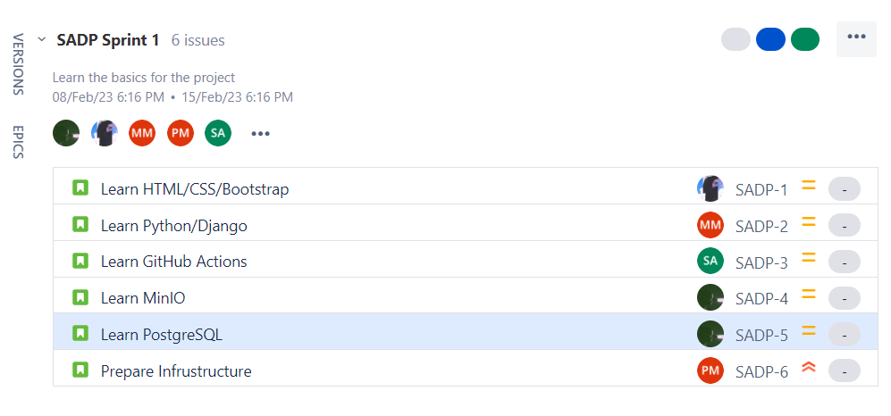

# Sprint 1 Planning Report

## Table of Contents
- [Introduction](#introduction)
- [Product Backlog](#product-backlog)
- [Sprint Backlog](#sprint-backlog)
- [Sprint Goal](#sprint-goal)
- [Definition of Done](#definition-of-done)
- [Acceptance Criteria](#acceptance-criteria)
- [Estimation](#estimation)
- [Capacity](#capacity)
- [Velocity](#velocity)

## Introduction
In the first stage we planned how to contribute to the project and we decided which members develop each aspect of the project.

The project consists of three main parts:
* Front-end
* Back-end
* Infrastructure

In the planning stage, members chose parts to contribute, and accordingly, in the next stage of the sprint, members started to learn and review the concepts to be able to work with the required frameworks.

In the end of this stage the chosen members of each aspect is as below:

**Front-end**

*Mohammadreza Daviran - Matin Moradi - Sara Azarnoosh - Mana Peirovian*

**Back-end**

*Parsa Mohammadian - Kahbod Aeini - Mohammadreza Daviran - Matin Moradi*

**Infrastructure**

*Parsa Mohammadian - Kahbod Aeini*

## Product Backlog
The following picture is a part of product backlog. Full product backlog is accessbile through [this link](https://sad-project.atlassian.net/jira/software/c/projects/SADP/issues/?filter=allissues).

## Sprint Backlog

## Sprint Goal

We decided to dedicate the first sprint to learning. Hence, in this sprint, each member learn the new and review the old concepts of the frameworks they have to work with through the project.

With respect to the responsibility of the members, we will learn these frameworks:

- HTML/CSS/Bootstrap
- Python/Django
- MinIO
- PostgreSQL
- Docker
- Github
- Jira

## Definition of Done
Definition of done is specified in every Jira stories. 

## Acceptance Criteria
Acceptance criteria is specified in every Jira stories. 

## Estimation
Estimation is specified in every Jira stories. 

## Capacity
For the first sprint, we decided to work 1 hour per day each for the entire week (no days off). Here is the capacity tracker status:

## Velocity
The total work in the sprint is 23 hours. So, the velocity is approximately 3.3 hours per day.